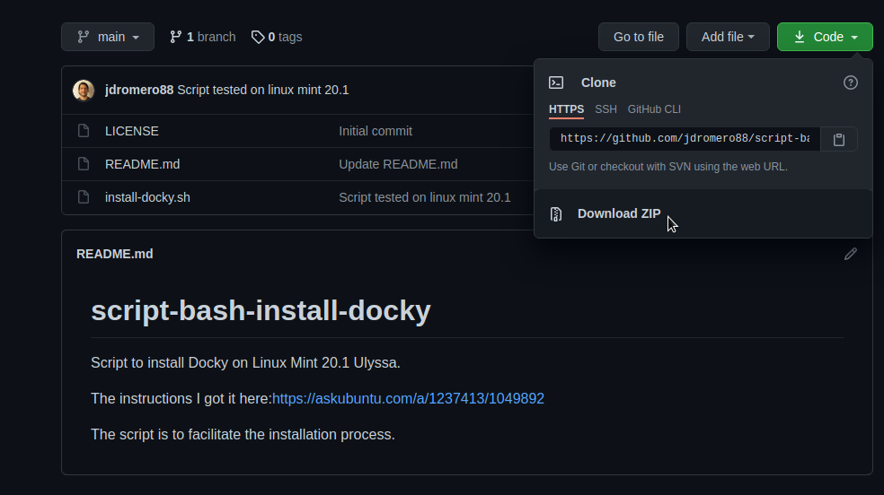
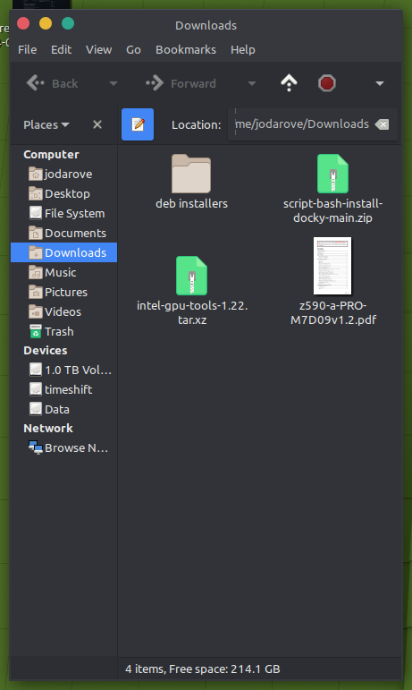
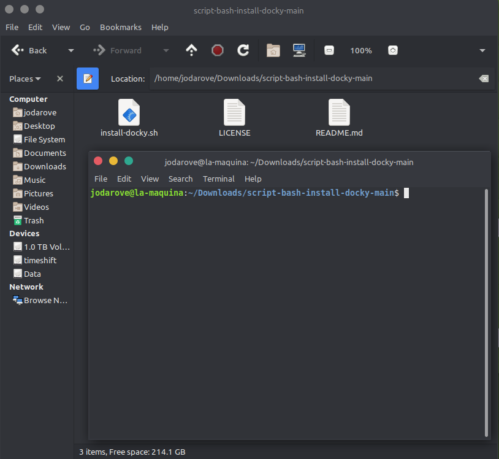
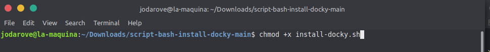
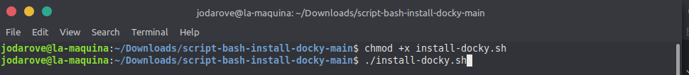
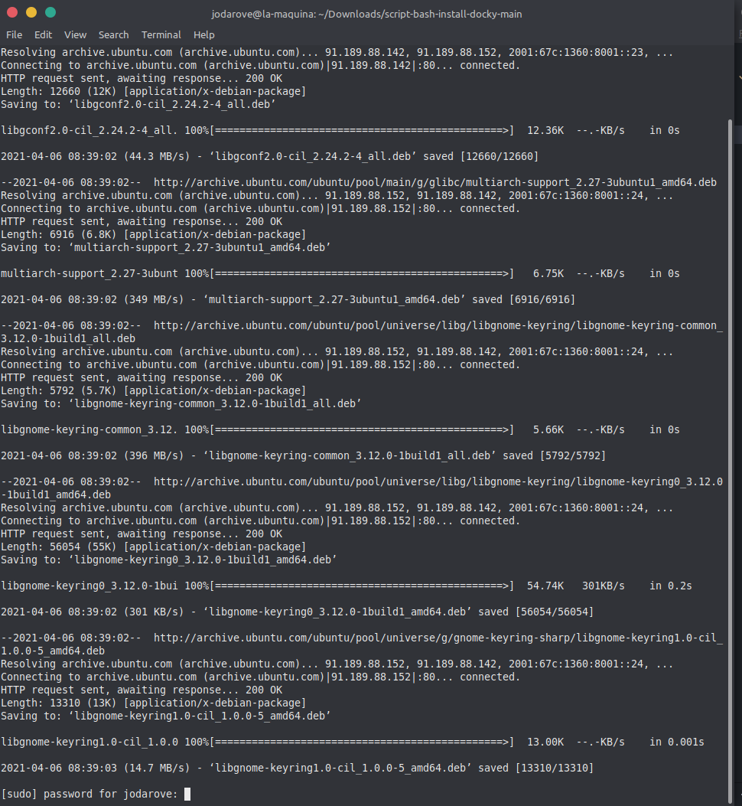
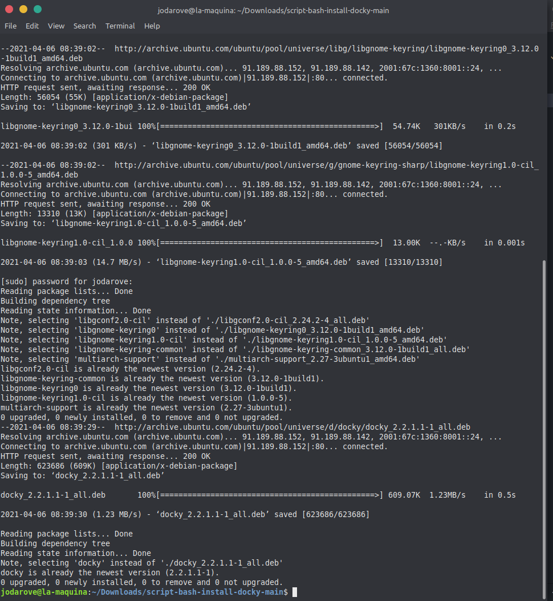
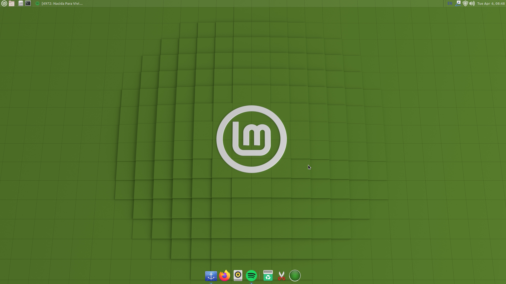

# script-bash-install-docky
Script to install Docky on Linux Mint 20.1 Ulyssa.

The instructions I got it [here](https://askubuntu.com/a/1237413/1049892)

The script is to facilitate the installation process.

## Steps to install it:
1- Download or clone the repo


2- Right click on the file ```script-bash-install-docky-main.zip``` > Extract here


3- Open the extracted folder (if you are in terminal change directory to the folder) ```cd script-bash-install-docky-main```

4- If you are not in a terminal right click any part of the window and click on > Open in Terminal


5- The next step is to make the script executable by assigning execute permission using the chmod command in your terminal run ```chmod +x install-docky.sh```


6- Now is time to run the Script ```./install-docky.sh```

**At some point is going to ask you for your password**


**Docky Installed**



7- Open Docky & Enjoy!

